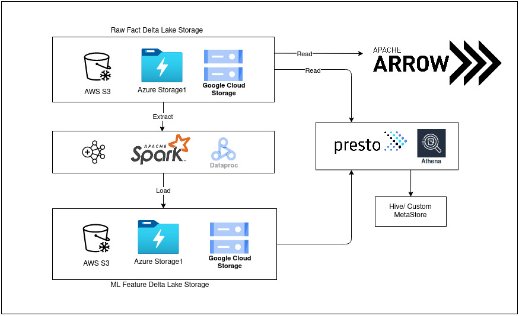

Building ML Feature Store using Lakehouse Architecture
------------------------------------------------------

I have been a very avid user of open source software.
Today, I am highlighting use-case of two popular software, [apache spark](https://spark.apache.org/),
[delta lake](https://delta.io/) and [PrestoDB](https://prestodb.io/)
for building a reliable, scalable, fast, versatile data storage
for large scale enterprise data for Machine Learning use cases.

##  Understanding use case

There is need for a growing enterprise ML Team for a storage system that can
be used storing cleaned feature data generated from *streaming* or *batch jobs*
over raw fact data.

Traditionally we were using cloud providers like [Google Cloud](https://cloud.google.com/gcp/), [AWS](https://aws.amazon.com/) data warehouses
like [BigQuery](https://cloud.google.com/bigquery/), [RedShift](https://aws.amazon.com/redshift/) respectively.

However, there are major challenges with data warehouses, such as
- data staleness,
- reliability,
- total cost of ownership,
- data lock-in,
- and limited use-case support.

Below is an excerpt from the official site [https://delta.io/](https://delta.io/)
> Delta Lake is an open-source storage framework that enables building a
[Lakehouse architecture](http://www.cidrdb.org/cidr2021/papers/cidr2021_paper17.pdf) with compute engines including Spark, PrestoDB, Flink, Trino, and Hive and APIs for Scala, Java, Rust, Ruby, and Python.

One can read in more detail about delta lake through the research paper or website.

### High level design representation

### Setting up feature lake

- Idea is to configure a multi-region, highly available bucket on top of any popular and cheap cloud storage like
  - [AWS S3](https://docs.aws.amazon.com/AmazonS3/latest/userguide/Welcome.html)
  - [Azure Blob Storage](https://azure.microsoft.com/en-in/services/storage/blobs/#overview)
  - [Google Cloud Storage](https://cloud.google.com/storage)

- Set up Apache Spark cluster in standalone or cluster mode.
- I have created a python client package that support delta lake CRUD operation.
  [https://pypi.org/project/python-prakashravip1/](https://pypi.org/project/python-prakashravip1/)

### Setting up PrestoDB

PrestoDB comes in picture as a SQL engine on top of our feature store built upon delta lake.
> Presto is an open source distributed SQL query engine for running interactive analytic queries against data sources of all sizes ranging from gigabytes to petabytes.

One can take a look at this article which explains in great detail on setting up
prestoDB in single node cluster or multi-node cluster [Getting started with prestodb](https://dzone.com/refcardz/getting-started-with-prestodb)

Writing down steps on how to go about setting up prestodb sql on our feature lake.

- Create a presto database.
- Generate a manifest file for delta table either using spark configured with delta lake
  at `at <path-to-delta-table>/_symlink_format_manifest/`. Manifest file is a snapshot of the delta table, generally
  in [apache parquet](https://parquet.apache.org/), which is read by prestodb to serve queries.
- Create a presto table with the same schema as delta table and specify the feature delta table storage path
- For Delta table having partitioned columns, run MSCK REPAIR TABLE mytable after generating the manifests to force the
  metastore (connected to Presto or Athena) to discover new partitions.

## References
- [http://www.cidrdb.org/cidr2021/papers/cidr2021_paper17.pdf](http://www.cidrdb.org/cidr2021/papers/cidr2021_paper17.pdf)
- [https://trino.io/paper.html](https://trino.io/paper.html)
- [delta.io/docs](https://docs.delta.io/latest/presto-integration.html#language-python)
